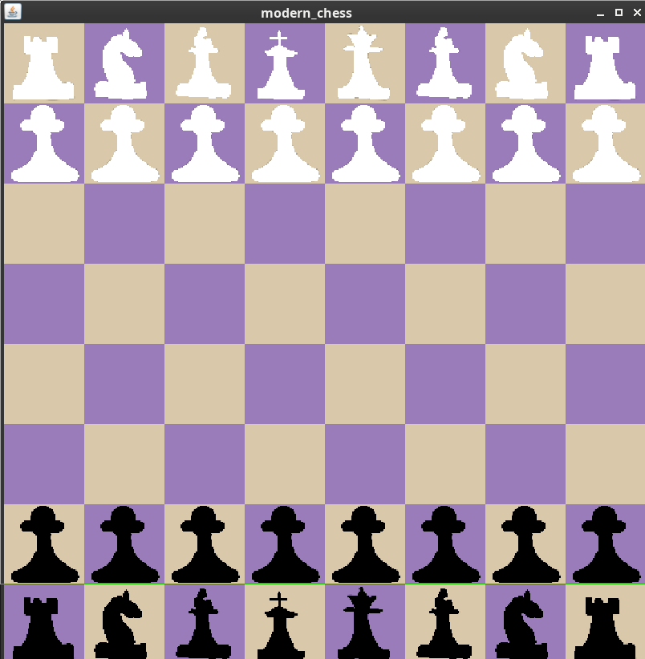
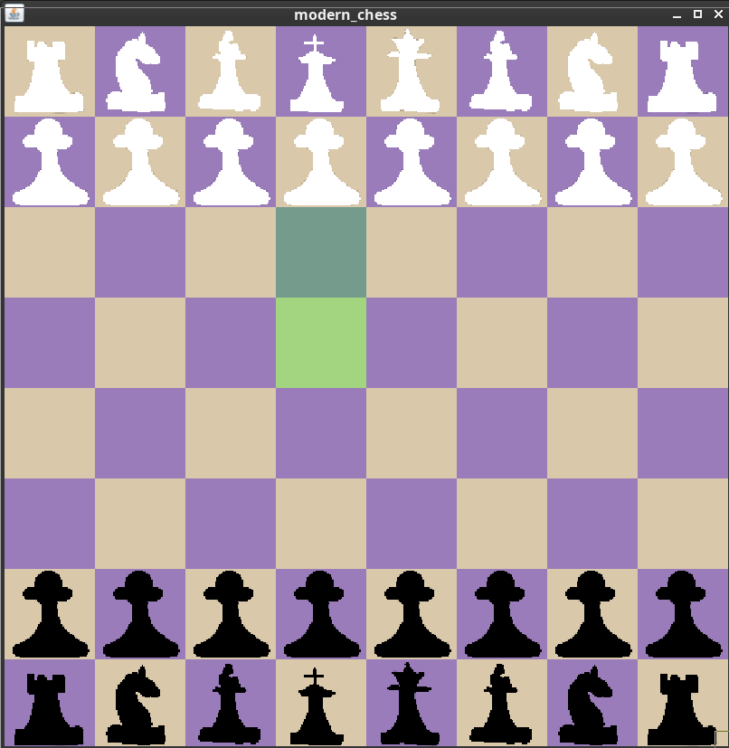
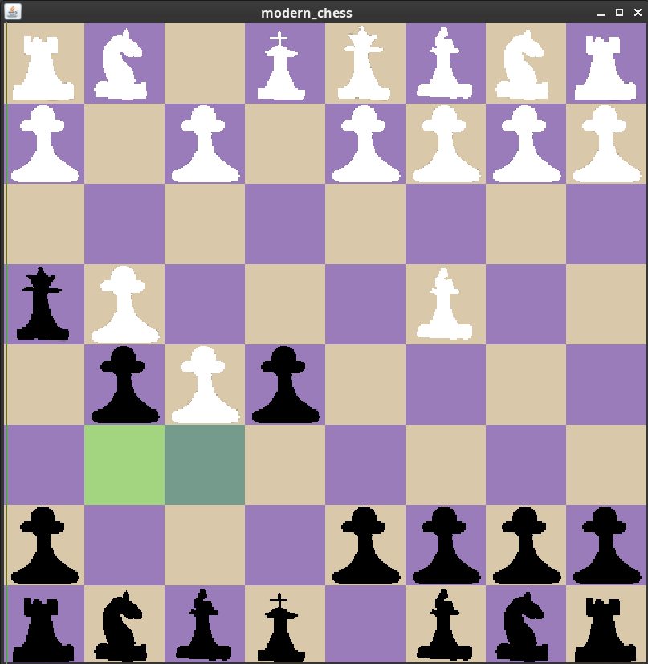
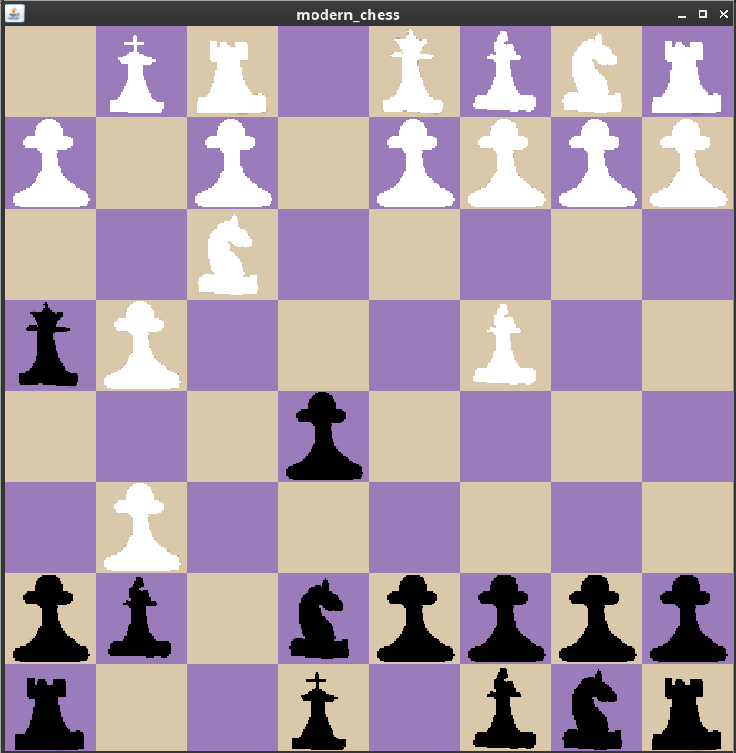
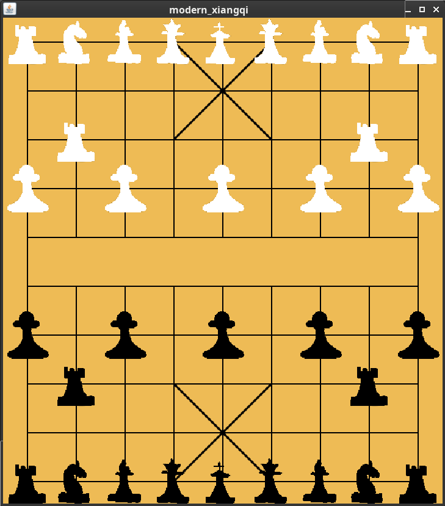
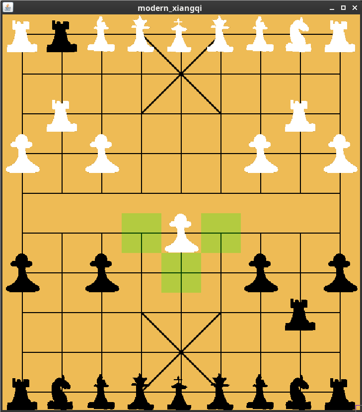
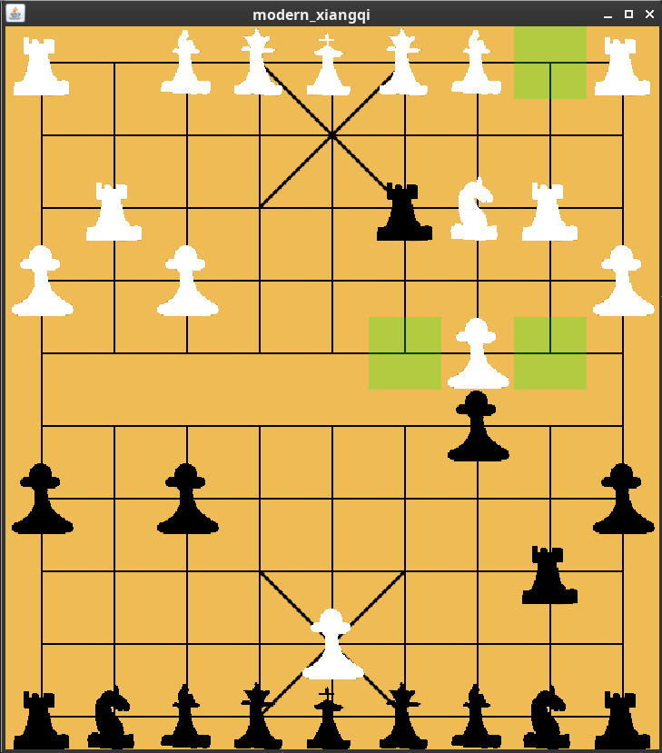

# Flexible Chess

This is a chess framework that reads game rule descriptions from files in a provided folder. It is intended to be capable of acting as an interface for all historical and non-historical chess variants that are actually playable (i.e. not infinite chess). This repository includes a full game description for modern chess, as well as a full game description for modern xiangqi (however it is missing proper icons for the pieces)

The project is compiled with `make.sh` and run with `run.sh [location of game description folder]`. For example to run the modern_chess description included in this project `./run.sh ./modern_chess` will work.

# Screenshots

## Chess
Game start

Piece selected for movement

En Passant

Castling

## Xiangqi

Game start

Top Soldier moving to the sides after crossing the river, and bottom cannon having jumped over the top side's cannon

Top horse with blocked movement due to bottom cannon

